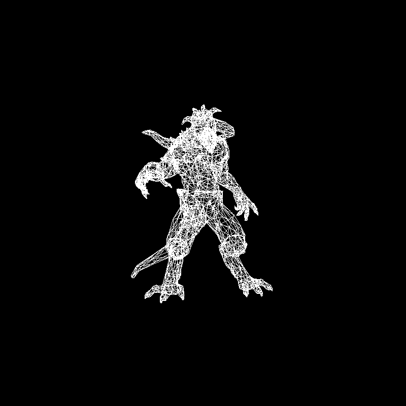
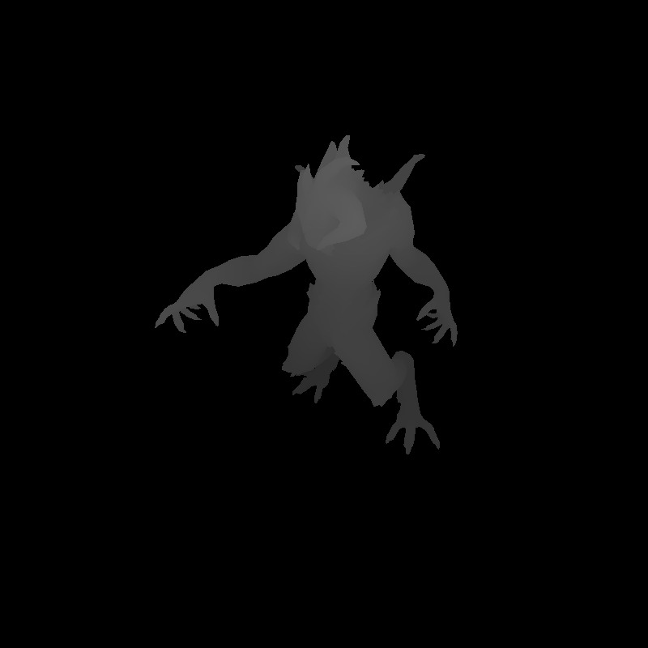
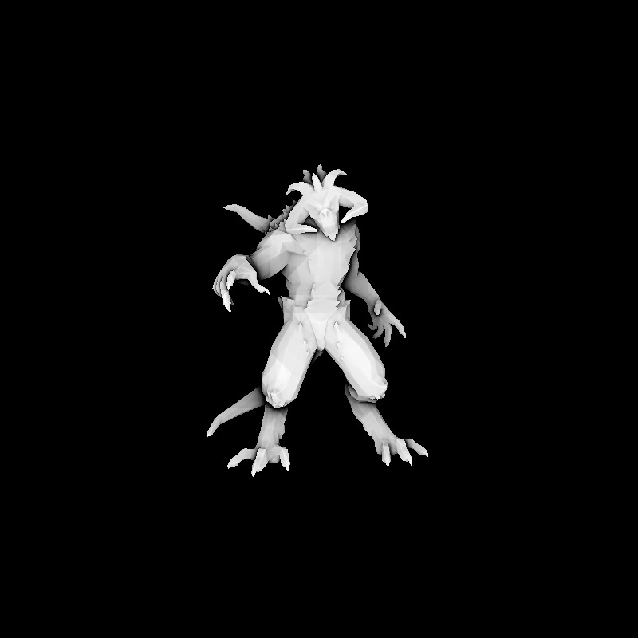

Practice of tinyrenderer
===
## Introduction
This project is for self-practicing of [tinyrenderer](https://github.com/ssloy/tinyrenderer) which complete a tiny renderer from scratch.
I also learn some knowledge of Computer Graphics from this lesson [GAMES101-现代计算机图形学入门-闫令琪](https://www.bilibili.com/video/BV1X7411F744?p=1&vd_source=01b45168c49e35b498136dfee5b61f26). 
If you understand Chinese, I think this lesson is quite useful while doing tinyrenderer. 
## Result

shadow frame

Screen Space Ambient Occlusion frame
